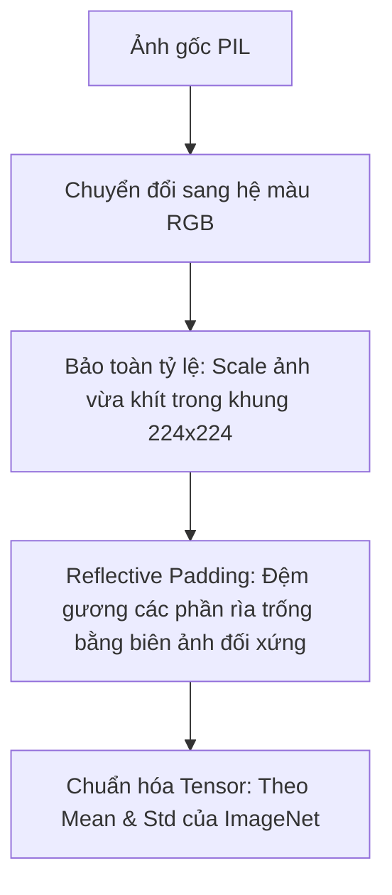

# Bản Thống Nhất Dữ Liệu & Ràng Buộc Ngữ Cảnh Cho Agent (docs/AGENT_ALIGNMENT.md)

Trong quy trình phát triển phần mềm và huấn luyện học sâu chuyên nghiệp, việc cộng tác với các AI Agent (như Gemini, Cursor, Copilot, hoặc các hệ thống MCP tự động) đòi hỏi nhiều hơn là chỉ đưa ra các câu lệnh trực tiếp. Các chuyên gia và nhà phát triển cao cấp thường thiết lập các tài liệu Markdown chuyên biệt để **định hình, thống nhất và ràng buộc không gian ngữ cảnh của mô hình**.

Tài liệu này trình bày các tiêu chuẩn công nghiệp về tài liệu thống nhất dữ liệu khi làm việc với AI Agent, tiếp theo là phần **Hợp đồng Dữ liệu & Logic thực tế** cho dự án Nhận dạng Phương tiện này.

---

## Phần 1: Tiêu Chuẩn Công Nghiệp Về Tài Liệu Đối Với AI Agent

Khi phát triển các hệ thống phức tạp cùng AI Agent, các nhà phát triển duy trì một bộ tài liệu Markdown chuyên dụng để ngăn ngừa lỗi ảo giác (hallucination), tránh các lỗi suy thoái logic (regression) và sự sai lệch về mặt ngữ nghĩa (semantic mismatch):

### 1. `.cursorrules` / `.cursor/rules/*.mdc` (Tệp quy tắc Agent)
Cấu hình được quản lý bằng Git nhằm tự động kích hoạt dựa trên định dạng tệp (file globs). Quy định rõ ràng về stack công nghệ, các ràng buộc tuyệt đối (ví dụ: "Không được dùng trực tiếp `transforms.Resize` làm méo ảnh mà không giữ nguyên tỷ lệ"), và các mẫu thiết kế (design patterns) trong code.

### 2. `DATA_ALIGNMENT.md` (Hợp đồng cấu trúc dữ liệu và hình học ảnh)
AI Agent thường rất dễ nhầm lẫn giữa các chiều Tensor, các tham số chuẩn hóa (normalization parameters), hoặc thứ tự phân phối lớp. Tài liệu này đóng vai trò khóa chặt kích thước đầu vào/đầu ra, đường dẫn thư mục, sơ đồ chỉ số phân loại (class indices), và các công thức tăng cường dữ liệu.

### 3. `ARCHITECTURE_DECISION_RECORDS.md` (Ghi nhận quyết định kiến trúc - ADR)
Tập hợp các tài liệu ngắn gọn, ghi chép lại lịch sử các quyết định thiết kế kiến trúc (ví dụ: tại sao chọn hàm lỗi Class-Balanced Focal Loss thay vì Cross Entropy, tại sao chọn các wrapper tích hợp đặc trưng thay vì dùng backbone mặc định). Điều này cung cấp cho Agent lý do "tại sao" đằng sau các phần code cũ.

### 4. `VERIFICATION_RUNBOOK.md` (Hợp đồng kiểm thử & CI)
Cung cấp cho Agent các lệnh chạy kiểm thử, vẽ biểu đồ loss, và xác thực pipeline một cách rõ ràng và xác định nhất, đảm bảo Agent không vô tình tạo ra các lỗi ngầm lúc runtime.

---

## Phần 2: Hợp Đồng Dữ Liệu & Tiền Xử Lý (Áp Dụng Cho Dự Án)

*Phần này đóng vai trò là nguồn chân lý ràng buộc bắt buộc đối với bất kỳ Agent nào tham gia chỉnh sửa mã nguồn dự án `vehicle-type-recognition`.*

### 1. Ràng Buộc Tiền Xử Lý Ảnh & Kích Thước Hình Học
Bất kỳ hình ảnh nào đi qua hệ thống (cho dù là tiền xử lý offline lúc sinh dữ liệu hay chạy suy luận online trên giao diện web) ĐỀU PHẢI tuân thủ luồng xử lý hình học sau đây để tránh làm méo mó phương tiện:



*   **Kích thước Canvas mục tiêu:** $224 \times 224$ pixels.
*   **Công thức bảo toàn tỷ lệ (Scale Preservation):**
    $$\text{scale} = \min\left(\frac{224}{\text{width}}, \frac{224}{\text{height}}\right)$$
*   **Quy tắc đệm viền (Padding):** BẮT BUỘC sử dụng **Reflective Padding** (`cv2.BORDER_REFLECT_101`) thay vì Zero-Padding (viền đen) để tránh tạo ra các cạnh sắc nhọn nhân tạo ở rìa ảnh gây rối loạn bộ lọc tích chập (convolution filters) và các khối chú ý (attention blocks).

### 2. Sơ Đồ Chỉ Số Phân Lớp & Số Lượng Mẫu Thực Tế Gốc
Các thư mục lớp được tải theo thứ tự chữ cái của hệ thống. Agent BẮT BUỘC phải tuân thủ thứ tự ánh xạ chỉ số này và sử dụng chính xác số lượng mẫu huấn luyện thực tế gốc ($n_i$) dưới đây để tính toán trọng số Class-Balanced Weighting:

| Chỉ số Lớp (Class Index) | Tên Lớp (Class Name) | Nhãn Tiếng Việt | Số Mẫu Huấn Luyện Gốc ($n_i$) |
| :---: | :--- | :--- | :---: |
| 0 | `bicycle` | Xe đạp | 1,334 |
| 1 | `boat` | Thuyền / Tàu | 7,390 |
| 2 | `bus` | Xe buýt | 3,395 |
| 3 | `car` | Ô tô | 7,111 |
| 4 | `helicopter` | Trực thăng | 568 |
| 5 | `minibus` | Xe khách nhỏ | 1,251 |
| 6 | `motorcycle` | Xe mô tô | 3,703 |
| 7 | `taxi` | Taxi | 765 |
| 8 | `train` | Tàu hỏa | 1,403 |
| 9 | `truck` | Xe tải | 3,125 |

---

## Phần 3: Đặc Tả Thuật Toán & Kiến Trúc Mô Hình

### 1. Công Thức Hàm Lỗi Class-Balanced Focal Loss
Để triệt tiêu độ thiên lệch (bias) của mô hình đối với các lớp đa số (`boat`, `car`), luồng tối ưu hóa sử dụng hàm lỗi Class-Balanced Focal Loss. Hàm lỗi đối với một mẫu đơn lẻ được định nghĩa như sau:

$$\mathcal{L}_{\text{CB-Focal}} = - W_y \cdot (1 - p_y)^\gamma \log(p_y)$$

Trong đó:
*   **Trọng số Số lượng Mẫu Hiệu dụng ($W_i$):**
    $$W_i = \frac{1 - \beta}{1 - \beta^{n_i}}$$
    Với các siêu tham số mặc định: $\beta = 0.999$, $\gamma = 2.0$.
*   **Chuẩn hóa Trọng số (Normalize Weights):**
    $$\text{Normalized } W_i = K \cdot \frac{W_i}{\sum_{j=1}^K W_j}$$
    Với $K = 10$ (tổng số lớp phương tiện).
*   **Khả năng tương thích đầu vào:** Lớp tính Loss này BẮT BUỘC phải hỗ trợ cả **Nhãn dạng số nguyên 1D** (Integer Targets) dùng khi test/valid thông thường và **Nhãn dạng phân phối xác suất mềm 2D** (Soft Targets) sinh ra từ các batch chạy MixUp/CutMix.

### 2. Cơ Chế Tích Hợp Đặc Trưng Đa Quy Mô (ResNet-50)
Backbone ResNet-50 phải được bọc trong một class Wrapper để ghép nối (concatenate) song song các đặc trưng không gian cục bộ từ Layer 3 với đặc trưng ngữ nghĩa cao cấp từ Layer 4:

```text
Input [B, 3, 224, 224]
  │
  ▼
Backbone Tầng Thấp (Layers 1-3) ──► Feature Map f3 [B, 1024, 14, 14] ──► Global Avg Pool ──► p3 [B, 1024]
  │                                                                                             │
  ▼                                                                                             ▼
Layer 4 ─────────────────────────► Feature Map f4 [B, 2048, 7, 7]    ──► Global Avg Pool ──► p4 [B, 2048]
                                                                                                │
                                                                                                ▼
                                                                                    Ghép nối [B, 3072]
                                                                                                │
                                                                                                ▼
                                                                                       Linear Head (fc)
                                                                                                │
                                                                                                ▼
                                                                                          Output [B, 10]
```

### 3. Tích Hợp CLS Token Đa Lớp (ViT-B/16)
Mô hình Vision Transformer phải được bọc để thu hoạch và ghép nối các CLS Tokens từ các lớp encoder trung gian thông qua cơ chế PyTorch forward hooks:

*   **Các Lớp Hook:** Layer 10, Layer 11, và Layer 12.
*   **Kích thước Đặc trưng:** Mỗi CLS token có kích thước 768 chiều. Sau khi ghép nối (fused representation) sẽ tạo thành vector $768 \times 3 = 2,304$ chiều.
*   **Classification Head:** Lớp Linear chiếu từ $2,304 \rightarrow 10$ lớp đầu ra.
