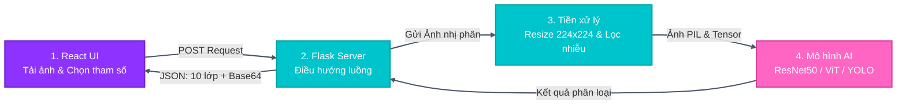
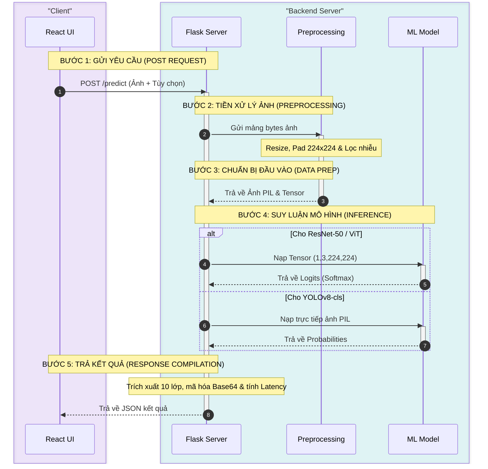

# Quy trình Xử lý Ảnh và Nhận diện Phương tiện (Image Processing & Inference Flow)

Tài liệu này mô tả chi tiết luồng xử lý dữ liệu từ giao diện React UI qua Flask API Server, dịch vụ Tiền xử lý (Preprocessing) đến các mô hình học máy (ResNet-50, ViT, YOLOv8-cls) và trả kết quả về cho người dùng.

## Sơ đồ khối ngang (Horizontal Flowchart)

Dưới đây là sơ đồ khối ngang luồng xử lý:

---

## Sơ đồ tuần tự 5 bước (5-Step Sequence Diagram)

Dưới đây là sơ đồ tuần tự 5 bước được thiết kế rộng rãi (widescreen), phân nhóm rõ ràng và tối ưu để hiển thị trên Slide:

---

## Chi tiết các bước xử lý

1. **Gửi yêu cầu (POST `/api/predict`):**
   * Người dùng tải lên một ảnh phương tiện giao thông bất kỳ từ React UI.
   * Người dùng lựa chọn mô hình dự đoán (ResNet-50 / ViT-B/16 / YOLOv8n-cls) và Pipeline tiền xử lý (Base / Weather / Blur & Sharpen).
   * Yêu cầu được gửi dưới dạng `multipart/form-data` chứa tệp tin ảnh và các tham số điều hướng.

2. **Tiền xử lý (Preprocessing):**
   * **Base Pipeline:** Ảnh được thay đổi kích thước (Resize) nhưng vẫn giữ nguyên tỷ lệ ban đầu để không làm méo mó phương tiện. Các khoảng trống thừa được lấp đầy bằng màu đen (Zero-padding) để đưa ảnh về kích thước chuẩn `224x224` pixel.
   * **Weather Pipeline (V1):** Nếu được chọn, ảnh sẽ tiếp tục được áp dụng các bộ lọc giả lập môi trường thời tiết như chèn hiệu ứng hạt mưa (Rain), tăng sáng mô phỏng lóa nắng (Sun), hoặc giảm độ phơi sáng kết hợp nhiễu hạt mô phỏng ban đêm (Night).
   * **Blur/Sharpen Pipeline (V2):** Nếu được chọn, ảnh được áp dụng các phép làm mờ (Gaussian Blur, Motion Blur) hoặc làm nét (Unsharp Mask).

3. **Chuyển đổi dữ liệu và Dự đoán (Inference):**
   * **Đầu ra tiền xử lý:** Trả về một đối tượng ảnh PIL phục vụ hiển thị và một Tensor PyTorch chuẩn hóa (chia cho 255.0 và chuẩn hóa theo mean/std của ImageNet) phục vụ tính toán.
   * **ResNet-50 / ViT:** Chuyển Tensor `(1, 3, 224, 224)` vào thiết bị tính toán (CPU/GPU) của mô hình. Mô hình chạy Forward Pass trả về Logits, sau đó Flask Server áp dụng hàm Softmax để tính xác suất (Confidence).
   * **YOLOv8-cls:** YOLO của thư viện `ultralytics` nhận trực tiếp đối tượng ảnh PIL đã xử lý và tự động thực hiện các bước chuyển đổi Tensor nội bộ, trả về mảng xác suất trực tiếp (`results[0].probs`).

4. **Tổng hợp kết quả:**
   * Hệ thống sắp xếp điểm tin cậy và trích xuất thông tin của **tất cả 10 lớp phương tiện** (thay vì chỉ giới hạn ở Top-3 như phiên bản cũ) để người dùng có cái nhìn toàn diện về phân phối xác suất dự đoán.
   * Tính toán thời gian xử lý (Latency) bằng cách đo khoảng thời gian từ lúc bắt đầu nhận ảnh đến khi hoàn tất suy luận.
   * Mã hóa ảnh sau tiền xử lý thành chuỗi Base64 để hiển thị trực quan lên UI.
   * Trả về JSON chứa danh sách 10 nhãn kèm độ tự tin, ảnh Base64, và thời gian trễ (ms).
