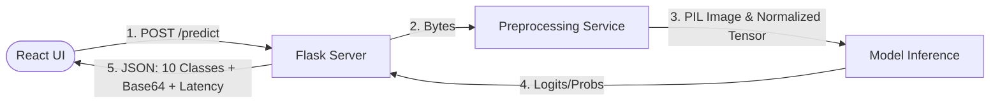

# Hướng Dẫn Chuẩn Bị Báo Cáo Tiến Độ (Progress Report Guide)

Tài liệu này tổng hợp toàn bộ kiến thức cốt lõi của dự án **VehicleTypeRecognition** nhằm giúp nhóm hiểu rõ cấu trúc dự án, chiến lược dữ liệu, luồng xử lý và tự tin trả lời các câu hỏi chất vấn từ hội đồng/giáo viên hướng dẫn.

---

## 1. Chiến lược Phân chia Dữ liệu (V1 & V2 Dataset Splits)

Dự án áp dụng nguyên tắc **Split-First Protocol** (Chia tập dữ liệu trước, tăng cường sau) để ngăn ngừa tuyệt đối hiện tượng rò rỉ dữ liệu (Data Leakage).

### 1.1. Tỷ lệ phân chia gốc (35.347 ảnh thô của tập `raw_cleaning`)
* **Train split (85% ~ 30.045 ảnh):** Dùng để huấn luyện và cập nhật trọng số mô hình. Chỉ tập này được áp dụng cân bằng lớp và tăng cường ảnh ngoại tuyến (offline augmentation).
* **Valid unseen split (5% ~ 1.767 ảnh):** Tập validation độc lập, dùng để theo dõi quá trình huấn luyện, thực hiện Early Stopping và chọn checkpoint tốt nhất (`best.pth`/`best.pt`). **Tuyệt đối không tăng cường nhiễu.**
* **Test split (10% ~ 3.535 ảnh):** Tập kiểm thử độc lập, hoàn toàn cô lập trong suốt quá trình huấn luyện. Chỉ được dùng để đánh giá hiệu năng cuối cùng sau khi đã chọn xong mô hình. **Tuyệt đối không tăng cường nhiễu.**
* **Valid traincopy (5% ~ 1.767 ảnh):** Bản sao trích xuất từ tập `train`. Đây là tập validation phụ dùng để kiểm tra mức độ ghi nhớ dữ liệu cũ của mô hình (seen data) so với dữ liệu mới (unseen data), đo lường overfitting. **Không tham gia vào quá trình chọn mô hình.**

### 1.2. Cân bằng dữ liệu (Class Balancing)
* Áp dụng chỉ trên tập **Train split**.
* Lớp lớn nhất là `boat` (7.390 ảnh) được chọn làm mốc (quota). Các lớp thiểu số (`taxi`, `helicopter`, `minibus`,...) được nhân bản hình học (lật, xoay, biến dịch, tương phản) để đạt đủ **70% quota** (5.173 ảnh/lớp) trước khi chèn nhiễu thời tiết/làm mờ.
* Tổng số ảnh tập Train sau khi cân bằng và tăng cường là **73.900 ảnh** (7.390 ảnh/lớp $\times$ 10 lớp).

### 1.3. Sự khác biệt giữa V1 và V2 (Offline Augmentation Buckets)
Cả V1 và V2 đều giữ nguyên **70% ảnh Normal** (ảnh gốc/ảnh biến đổi hình học cơ bản). Sự khác biệt nằm ở **30% dữ liệu nhiễu** được chèn bằng thuật toán xử lý ảnh truyền thống (OpenCV/PIL):

| Phiên bản dữ liệu | Normal (70%) | Nhóm nhiễu 1 (10%) | Nhóm nhiễu 2 (10%) | Nhóm nhiễu 3 (10%) |
| :--- | :--- | :--- | :--- | :--- |
| **V1 (Weather - Thời tiết)** | Bình thường | **Rain** (Chèn mưa) | **Sun** (Lóa nắng) | **Night** (Tối/Nhiễu hạt) |
| **V2 (Blur/Sharpen - Mờ/Nét)** | Bình thường | **Gaussian Blur** (Mờ đều) | **Motion Blur** (Mờ động) | **Unsharp Mask** (Làm nét) |

* **Quy tắc công bằng:** Tập `valid_unseen` và `test` của V1 và V2 giống nhau 100% (cùng mã băm SHA-256), chỉ đi qua **Base Pipeline** (Resize + Pad 224x224), giúp so sánh khách quan hiệu năng giữa 2 phiên bản nhiễu.

---

## 2. Luồng Xử Lý Dữ Liệu (Processing Flow)

### 2.1. Luồng Huấn luyện (Training Pipeline)
1. Chạy `src/data_prep.py` $\rightarrow$ Chia tập (splits) $\rightarrow$ Cân bằng lớp $\rightarrow$ Áp dụng Base Pipeline $\rightarrow$ Tăng cường V1 Weather $\rightarrow$ Xuất file thống kê V1 JSON.
2. Chạy `src/augment_offline_v2.py` trỏ vào tập balanced vừa tạo $\rightarrow$ Tăng cường V2 Blur/Sharpen $\rightarrow$ Xuất file thống kê V2 JSON.
3. Đóng gói ZIP gửi lên Kaggle để chạy train song song các mô hình: ResNet-50, ViT-B/16, YOLOv8n-cls với tham số cấu hình đồng bộ (30 epochs, Batch 128/64, Tối ưu hóa AMP).
4. Xuất tệp trọng số (`.pth`/`.pt`) và tệp JSON kết quả đánh giá về thư mục `outputs/` của dự án local.

### 2.2. Luồng Dự đoán trực tuyến (Inference Pipeline - 5 bước tuần tự)

1. **Bước 1: Gửi yêu cầu:** Người dùng tải ảnh lên React UI, chọn Model và Pipeline. React gửi request POST kèm tệp ảnh và tham số sang Flask API.
2. **Bước 2: Tiền xử lý:** Dịch vụ tiền xử lý thực hiện Base Pipeline (Resize giữ tỷ lệ, bù viền đen Zero-pad về 224x224). Sau đó chèn thêm hiệu ứng (V1/V2) trực tiếp lên ảnh nếu người dùng chọn.
3. **Bước 3: Chuẩn bị đầu vào:** Tạo ảnh PIL đã xử lý (để hiển thị UI và nạp cho YOLO) và PyTorch Tensor đã chuẩn hóa ImageNet mean/std (để nạp cho ResNet/ViT).
4. **Bước 4: Thực hiện suy luận:** Truyền dữ liệu vào mô hình. ResNet/ViT nhận Tensor $\rightarrow$ Logits $\rightarrow$ chạy hàm **Softmax**. YOLO nhận PIL Image $\rightarrow$ trích xuất lớp từ `.probs`.
5. **Bước 5: Tổng hợp kết quả:** Flask Server sắp xếp độ tự tin của cả 10 lớp phương tiện, tính toán độ trễ suy luận (latency - ms), mã hóa ảnh đã tiền xử lý thành Base64, và trả lời bằng JSON về phía client.

---

## 3. Cấu Trúc Dự Án & Các Cấu Hình Quan Trọng

### 3.1. Cấu trúc thư mục chính
* `backend/`: Chứa mã nguồn Flask API.
  * `routes/predict.py`, `routes/metrics.py`: Định nghĩa các endpoint API nhận diện và trả số liệu thống kê.
  * `services/model_loader.py`: Nạp động các mô hình `.pth` (PyTorch) hoặc `.pt` (YOLO) lên CPU/GPU và lưu cache để tối ưu hiệu năng.
  * `services/inference_service.py`: Thực hiện chạy suy luận qua mô hình và định dạng kết quả.
  * `utils/preprocessing.py`: Chứa mã nguồn thực hiện Base Pipeline và chuẩn hóa Tensor ImageNet.
* `frontend/`: Ứng dụng React UI xây dựng bằng Vite.
  * `src/components/Dashboard.jsx`: Giao diện Dashboard so sánh hiệu năng các phiên bản, vẽ biểu đồ phân phối tập dữ liệu và ma trận nhầm lẫn (Confusion Matrix).
  * `src/components/PredictionResult.jsx`: Hiển thị ảnh sau tiền xử lý và thanh phân phối độ tự tin của 10 lớp xe.
* `src/`: Các script huấn luyện và đánh giá trên Kaggle/Local (`train_yolo.py`, `evaluate_yolo.py`).
* `outputs/`: Chứa `experiment_registry.json` đóng vai trò là "mục lục" đăng ký các mô hình và tệp JSON kết quả đánh giá để Flask API đọc và hiển thị lên Dashboard.

### 3.2. Cấu hình Huấn luyện mô hình chuẩn
* **Kiến trúc mô hình:** ResNet-50 (CNN tiêu chuẩn), ViT-B/16 (Vision Transformer), YOLOv8n-cls (CNN siêu nhẹ tối ưu thời gian thực).
* **Số Epoch tối đa:** 30 Epochs (đồng bộ cho cả 3 mô hình).
* **Kích thước đầu vào:** 224x224 pixel.
* **Batch size:** 128 (YOLO), 64 (ResNet, ViT).
* **Tự động tăng cường khi train (Online augmentation):** Tắt hoàn toàn (tắt RandomResizedCrop, RandAugment) để tránh làm nhiễu loạn phân phối 70% Normal / 30% Noise của tập dữ liệu offline thiết kế riêng.

---

## 4. Những Câu Hỏi Cô/Hội Đồng Dễ Chất Vấn Khi Báo Cáo

### Câu hỏi 1: Tại sao lại chọn phân chia tỷ lệ 85% Train, 5% Valid, 10% Test? Việc có tập `valid_traincopy` (phát sinh từ train) có gây rò rỉ dữ liệu (data leakage) không?
* **Trả lời:** Tỷ lệ 85/5/10 phân bổ trên tổng dữ liệu thô lớn (~35K ảnh) đảm bảo tập validation và test độc lập có đủ số lượng đại diện (~1.7K và ~3.5K ảnh). `valid_traincopy` không phải tập validation độc lập; nó là bản sao từ train được tạo ra theo yêu cầu của GVHD nhằm so sánh trực tiếp độ chính xác của mô hình trên dữ liệu đã học (seen) với dữ liệu chưa học (unseen), đo lường mức độ overfitting. Nó **không bao giờ** được dùng để early stopping hay chọn checkpoint, do đó không gây rò rỉ dữ liệu.

### Câu hỏi 2: Tại sao lại chọn cách tiền xử lý ảnh và chèn nhiễu ngoại tuyến (Offline Augmentation) thay vì làm trực tuyến (Online Augmentation trong lúc train)?
* **Trả lời:** Làm offline giúp chúng ta kiểm soát chính xác 100% tỷ lệ phân bổ phân phối dữ liệu (luôn cố định 70% Normal, 10% Rain, 10% Sun, 10% Night hoặc 10% Blur/Sharpen) cho từng lớp. Nếu dùng online augmentation, các phép biến đổi ngẫu nhiên có thể tạo ra phân phối không đồng đều giữa các epoch và các lớp, gây mất cân bằng. Ngoài ra, việc lưu trữ offline giúp nhóm dễ dàng kiểm tra trực quan chất lượng ảnh đầu vào của mô hình trước khi chạy huấn luyện trên Kaggle.

### Câu hỏi 3: Giải thích cơ chế tiền xử lý Base Pipeline. Tại sao không dùng resize trực tiếp về 224x224 mà phải Zero-pad?
* **Trả lời:** Nếu resize trực tiếp một bức ảnh chữ nhật (ví dụ tỷ lệ 16:9) về hình vuông 224x224, phương tiện sẽ bị bóp méo hình dạng (xe con sẽ trông ngắn lại, xe khách bị dẹt đi), làm thay đổi đặc trưng hình học mà mô hình học được. Việc *Resize giữ nguyên tỷ lệ* phối hợp với *bù viền đen (Zero-pad)* giúp giữ đúng hình dạng thực tế của phương tiện, tăng độ chính xác phân loại.

### Câu hỏi 4: So sánh kiến trúc ResNet-50, YOLOv8n-cls và ViT. Tại sao ViT lại có độ chính xác cao nhất nhưng YOLO lại phù hợp cho triển khai thực tế nhất?
* **Trả lời:** ViT (Vision Transformer) sử dụng cơ chế Self-Attention nắm bắt ngữ cảnh toàn cục của bức ảnh, giúp học tốt các đặc trưng hình dáng dài hạn (như mối liên quan giữa cabin và chiều dài xe). Tuy nhiên, ViT có số lượng tham số lớn (~86M, file ~543MB) và độ trễ suy luận cao (~300ms trên CPU). YOLOv8n-cls là mô hình CNN siêu nhẹ (~3MB), suy luận cực nhanh (~50ms trên CPU), phù hợp cho thiết bị biên và chạy thời gian thực.

### Câu hỏi 5: Có hiện tượng "data leakage" (rò rỉ dữ liệu) nào xảy ra khi huấn luyện V1 và V2 không? Làm sao đảm bảo so sánh công bằng giữa V1 và V2?
* **Trả lời:** Nhóm tuân thủ nghiêm ngặt nguyên tắc **Split-First Protocol** (Chia tập dữ liệu trước rồi mới cân bằng và tăng cường offline). Tập validation (`valid_unseen`) và `test` được cô lập hoàn toàn trước khi tạo V1/V2, và **không bao giờ bị tăng cường**. Tập test và validation của V1 và V2 có cùng mã băm SHA-256 (tức là giống nhau 100%), đảm bảo việc so sánh hiệu năng giữa hai phiên bản là hoàn toàn công bằng.
